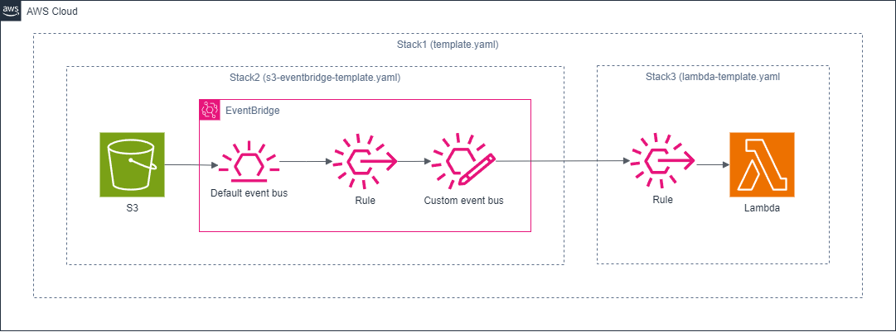

# nested-sam-app-1

## Nested SAM Application: S3 Event to Lambda via EventBridge

This project demonstrates a nested AWS Serverless Application Model (SAM) application that triggers a Lambda function when a file is generated in an S3 bucket, using Amazon EventBridge as the event router.

## Project Structure

The application consists of three SAM templates:

1. `template.yaml` - The main template that orchestrates the nested stacks.
2. `s3-eventbridge-template.yaml` - Defines the S3 bucket and EventBridge rule.
3. `lambda-template.yaml` - Defines the Lambda function to be triggered.

## Architecture



1. When a file is uploaded to the S3 bucket, it generates an event.
2. The S3 event is sent to Amazon EventBridge.
3. EventBridge routes the event based on the defined rule.
4. The Lambda function is triggered in response to the event.

## Prerequisites

- AWS CLI
- AWS SAM CLI
- An AWS account with appropriate permissions

## Deployment

To deploy this application:

1. Clone this repository:

```
git clone https://github.com/hiroaki-ma1203/aws-sam-samples.git
cd aws-sam-samples/nested-sam-app-1
```

2. Build the SAM application:

```
sam build
```

3. Deploy the application:

```
sam deploy --guided
```

Follow the prompts to set up your deployment configuration.

## Usage

After deployment, any file uploaded to the created S3 bucket will trigger the Lambda function via EventBridge. You can monitor the Lambda function's execution in the AWS Console or through CloudWatch Logs.

## Customization

- Modify `s3-eventbridge-template.yaml` to adjust the S3 bucket configuration or EventBridge rule.
- Update `lambda-template.yaml` to change the Lambda function's code or configuration.
- Adjust the main `template.yaml` to add or modify how the nested stacks are referenced.

## Cleanup

To remove all resources created by this application:

- Delete files in the S3 bucket.
```
aws cloudformation describe-stacks --stack-name nested-sam-app-1 --query "Stacks[0].Outputs[?OutputKey=='S3BucketName'].OutputValue" --output text | xargs -I {} aws s3 rm s3://{} --recursive
```

- Delete stacks.
```
sam delete
```

## License

This project is licensed under the Apache-2.0 License.
