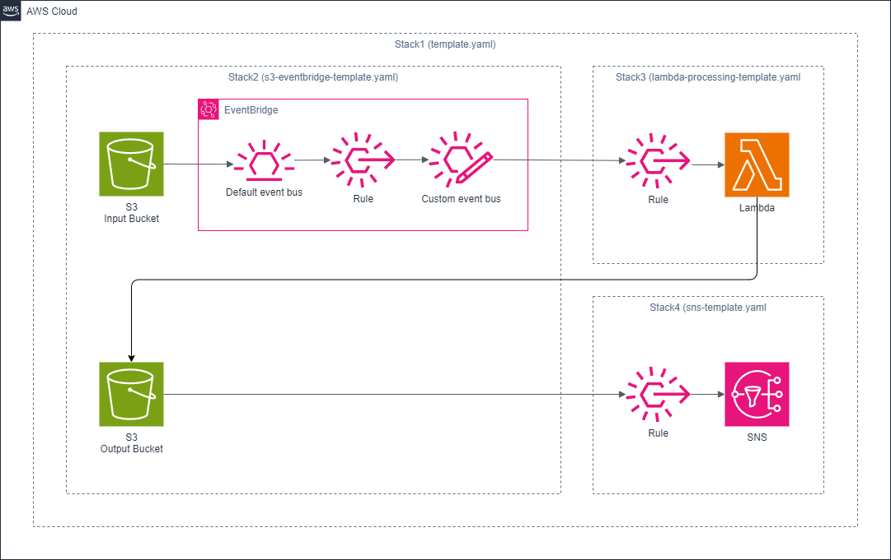

# nested-sam-app-2

## Nested SAM Application: S3 Event Processing with EventBridge, Lambda, and SNS

This project demonstrates a comprehensive nested AWS Serverless Application Model (SAM) application that processes files between S3 buckets and sends notifications via SNS when processing is complete.

## Project Structure

The application consists of four SAM templates:

1. `template.yaml` - The main template that orchestrates the nested stacks.
2. `s3-eventbridge-template.yaml` - Defines the input/output S3 buckets and EventBridge bus.
3. `lambda-processing-template.yaml` - Defines the Lambda function that processes files.
4. `sns-template.yaml` - Defines the SNS topic for notifications.

## Architecture



1. When a file is uploaded to the input S3 bucket, it generates an event.
2. The S3 event is sent to Amazon EventBridge.
3. EventBridge routes the event to the Lambda function.
4. The Lambda function copies the file from the input bucket to the output bucket.
5. When a file is created in the output bucket, it triggers an SNS notification.
6. The SNS notification is sent to the subscribed email address.

## Prerequisites

- AWS CLI
- AWS SAM CLI
- An AWS account with appropriate permissions

## Deployment

To deploy this application:

1. Clone this repository:

    ```
    git clone https://github.com/hiroaki-ma1203/aws-sam-samples.git
    cd aws-sam-samples/nested-sam-app-2
    ```

2. Build the SAM application:

    ```
    sam build
    ```

3. Deploy the application:

    ```
    sam deploy --guided
    ```

Follow the prompts to set up your deployment configuration. You'll need to provide:
- Stack name (default: nested-sam-app-2)
- AWS Region
- Resource prefix (default: nested-sam-app-2)
- Email address for SNS notifications

## Usage

After deployment:

1. Upload a file to the input S3 bucket.
2. The Lambda function will automatically copy the file to the output bucket.
3. You'll receive an email notification about the new file in the output bucket.
4. Confirm the SNS subscription in your email to start receiving notifications.

## Monitoring and Troubleshooting

- Lambda function logs are available in CloudWatch Logs.
- Dead Letter Queues (DLQs) are configured for both EventBridge rules and the Lambda function to capture any failed events or executions.
- All resources are tagged with the prefix parameter for easy identification.

## Cleanup

To remove all resources created by this application:

1. Empty the S3 buckets:

    ```
    aws s3 rm s3://[INPUT-BUCKET-NAME] --recursive
    aws s3 rm s3://[OUTPUT-BUCKET-NAME] --recursive
    ```

    Here is a command to easily empty it:

    ```bash
    # Empty the input bucket
    aws cloudformation describe-stacks --stack-name nested-sam-app-2 --query "Stacks[0].Outputs[?OutputKey=='InputBucketName'].OutputValue" --output text | xargs -I {} aws s3 rm s3://{} --recursive

    # Empty the output bucket
    aws cloudformation describe-stacks --stack-name nested-sam-app-2 --query "Stacks[0].Outputs[?OutputKey=='OutputBucketName'].OutputValue" --output text | xargs -I {} aws s3 rm s3://{} --recursive
    ```

2. Delete the CloudFormation stack:

    ```
    sam delete
    ```

## License

This project is licensed under the [Apache-2.0 License](https://www.apache.org/licenses/LICENSE-2.0).
